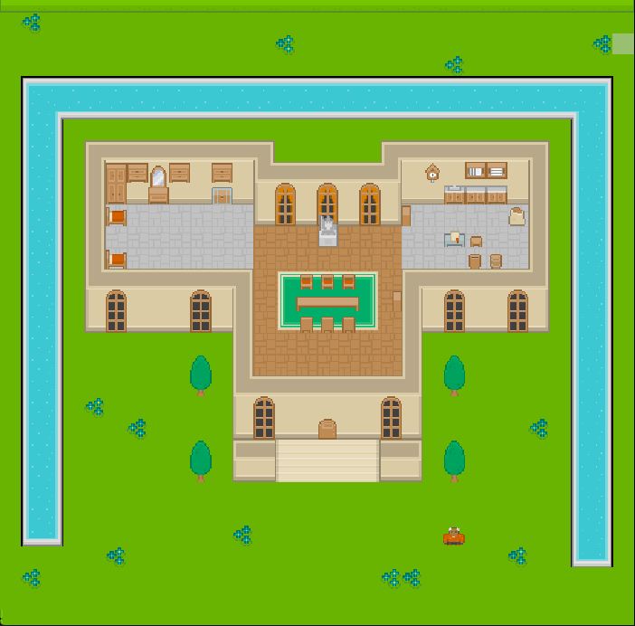

Cycles System
=============

[WIP] A turn-based game system built with [Phaser 3](http://phaser.io).

## Roadmap

[See the projects section](https://github.com/rootasjey/cycles-system/projects)

## Development

- Install (if you don't have them):
  - [Node.js](https://nodejs.org)
  - [Brunch](http://brunch.io): `npm install -g brunch`
- Run:
  - `npm run start` or `brunch watch --server` watches the project with continuous rebuild.
  - `npm run build` or `brunch build --production` builds a minified project for production.
  - [troubleshooting](http://brunch.io/docs/troubleshooting)
- Make:
  - Write your code in [app](app).
  - Put game assets in [assets](app/static/assets).

## Specifications

### Goal

Reach one of the map objectives:

* Defeat all enemies
* Survive X days
* Defeat a specific enemy
* Rescue someone

### A player turn

A typical player turn:

* Move units
* Make units attack or use items
* End turn

## Tools

- [brunch](http://brunch.io/docs/config)
- [babel-brunch](https://www.npmjs.com/package/babel-brunch#configuration)
- [uglify-js-brunch](https://www.npmjs.com/package/uglify-js-brunch#usage)
  - [minify options](https://www.npmjs.com/package/uglify-js#minify-options)

[1]: https://developer.mozilla.org/en-US/docs/Web/JavaScript/Reference/Statements/import
[2]: https://developer.mozilla.org/en-US/docs/Web/JavaScript/New_in_JavaScript/ECMAScript_2015_support_in_Mozilla

## Thanks

Thanks to these awesome tools and assets, I can have fun building a game

* [Kenney assets](https://www.kenney.nl)
* [Phaser 3](http://phaser.io)
